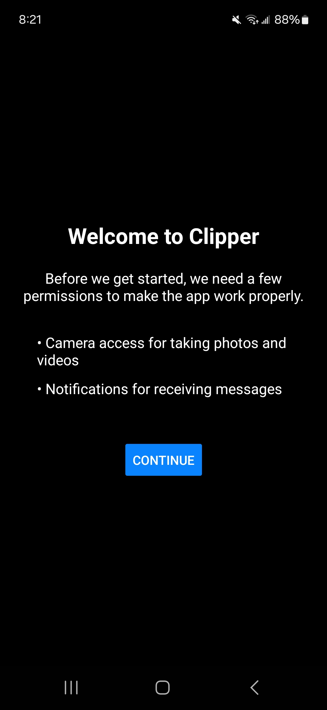
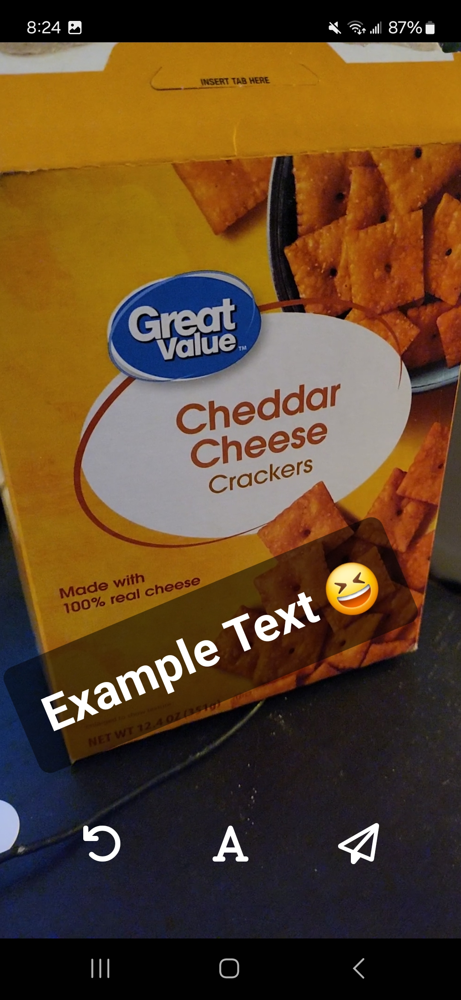

# Clipper App

This is a react native application built with Expo that allows users to capture photos or short videos and share them with others via a self-hosted [Clipper Server](https://github.com/clipper-camera/clipper-server) allowing for all data to be private and secure. Currrently the app is in a proof-of-concept phase. 


Key Features:
- Fast video capture and (slower) photo capture
- Drag to zoom into video
- Text overlays on videos and photos
- Sharing with multiple people
- Settings page to configure remote server & view uploads
- Notifications & page to view recieved messages


## Getting Started

Ensure you have the following setup to access in your commandline

- [Node.js](https://nodejs.org/) (LTS version recommended)
- [npm](https://www.npmjs.com/) or [Yarn](https://yarnpkg.com/)
- [Expo CLI](https://docs.expo.dev/get-started/installation/)
- [Expo Go](https://expo.dev/client) app on your mobile device (for testing)


Get all the dependencies
```bash
npm install
npx expo start
```

Now start the local development server
- Scan the QR code with your mobile device using the Expo Go app (Android) or the Camera app (iOS)
- Press 'a' to open on an Android emulator
- Press 'i' to open on an iOS simulator

```bash
npx expo start
```

To build the app for production via EAS build system

```bash
eas build --platform android
eas build --platform ios # (untested...)
```


## Example Screenshots







